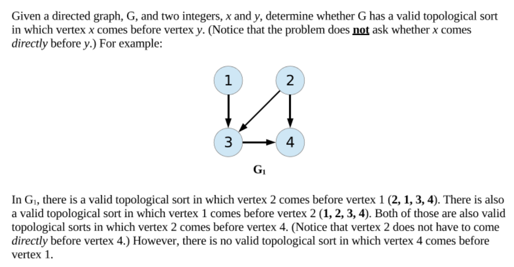
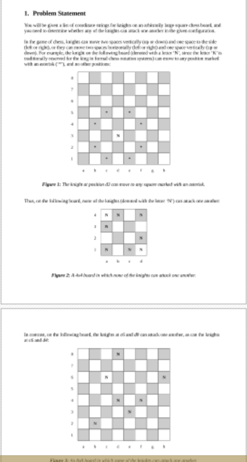

# Computer-Science 2 work
Projects from CS2 

Java 8 code 

Triston Hernandez 2017 

1) Constrained TopoSort:

2) Generic BST:

- Coded a Binary Search Tree using Java's built in Generics for any data type.

3) Sneaky Knights:

